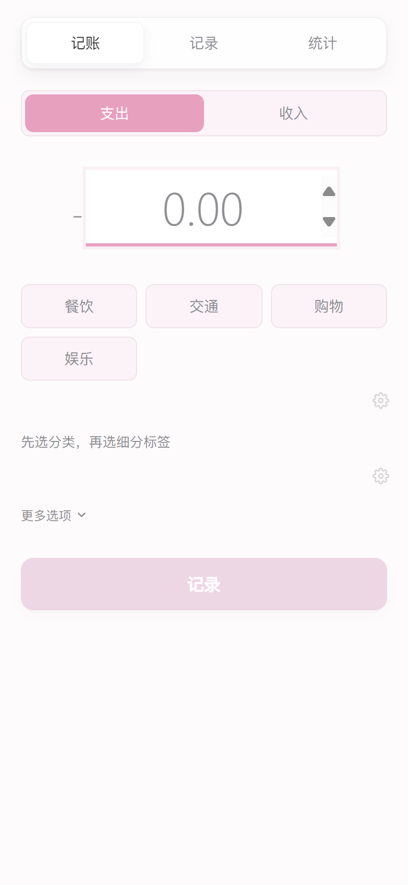
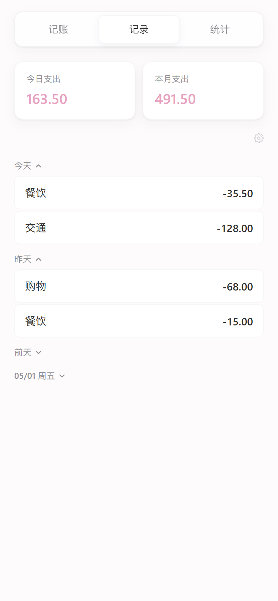
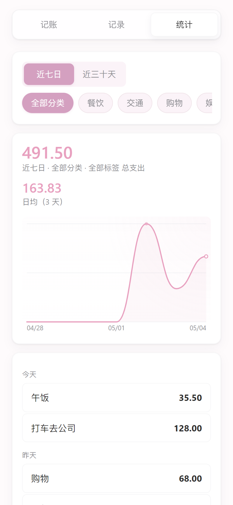

<p align="center">
  
</p>

<h1 align="center">记账</h1>

<p align="center">
  <strong>极简个人记账 PWA</strong><br/>
  樱花粉主题 · 纯手写 CSS · 零 UI 框架 · 移动端优先
</p>

<p align="center">
  
  
  
  
</p>

<p align="center">
  <a href="https://accounting-app-9f0.pages.dev"><strong>在线体验 →</strong></a>
</p>

---

<p align="center">
  &nbsp;&nbsp;
  &nbsp;&nbsp;
  
</p>

---

## 功能

<table>
<tr>
<td width="50%">

### 记一笔
输入金额，选分类，完成。备注和时间默认折叠，保持界面干净。分类下可设细分标签，从记账页直接管理。

</td>
<td width="50%">

### 看记录
按日期自动分组 — 今天、昨天、前天，或 MM/DD 周X。日期组可折叠，点击任意记录直接编辑。

</td>
</tr>
<tr>
<td>

### 统计曲线
近七日 / 近三十天支出曲线，SVG 手绘，无图表库。支持按分类和细分标签筛选，点击曲线上任意点查看当日金额。

</td>
<td>

### 数据与同步
导出 JSON / CSV，导入备份支持合并或覆盖。云端同步基于 Cloudflare Worker + D1，密码认证，revision 冲突检测。

</td>
</tr>
</table>

## 技术栈

| 层 | 选型 |
|---|---|
| 框架 | React 19 + Vite 8 |
| 样式 | 纯 CSS，CSS Variables，手写组件样式 |
| 图表 | SVG 手绘曲线（`<path>` + 贝塞尔插值） |
| 存储 | localStorage |
| 同步 | Cloudflare Worker + D1（可选） |
| 部署 | PWA，可安装到主屏幕 |

## 开发

```bash
npm install
npm run dev
```

```bash
npm run build    # 构建生产版本
```

## 项目结构

```
src/
├── components/
│   ├── RecordForm.jsx     # 记账表单
│   ├── RecordList.jsx     # 记录列表 + 编辑 + 数据管理
│   ├── Statistics.jsx     # 统计图表
│   ├── ManageItems.jsx    # 分类 / 标签管理
│   ├── Header.jsx         # 底部导航
│   ├── Modal.jsx          # 底部弹窗
│   └── TagInput.jsx       # 标签选择器
├── hooks/
│   ├── useRecords.js
│   ├── useCategories.js
│   └── useTags.js
├── utils/
│   ├── format.js          # 日期 / 金额格式化
│   ├── statistics.js      # 统计数据计算
│   ├── export.js          # CSV / JSON 导出
│   ├── backup.js          # 备份导入导出
│   ├── sync.js            # 云端同步
│   └── storage.js         # localStorage 封装
├── App.jsx
└── index.css              # 全局主题变量
```

## 设计系统

| 变量 | 值 | 用途 |
|:--|:--|:--|
| `--color-expense` | `#E8A0BF` | 支出 / 主题色 |
| `--color-income` | `#A8D5BA` | 收入 |
| `--color-primary` | `#d4a0c0` | 交互高亮 |
| `--color-bg` | `#FEFBFC` | 页面背景 |
| `--radius` | `12px` | 卡片圆角 |

移动端优先，最大宽度 480px。

## License

MIT
