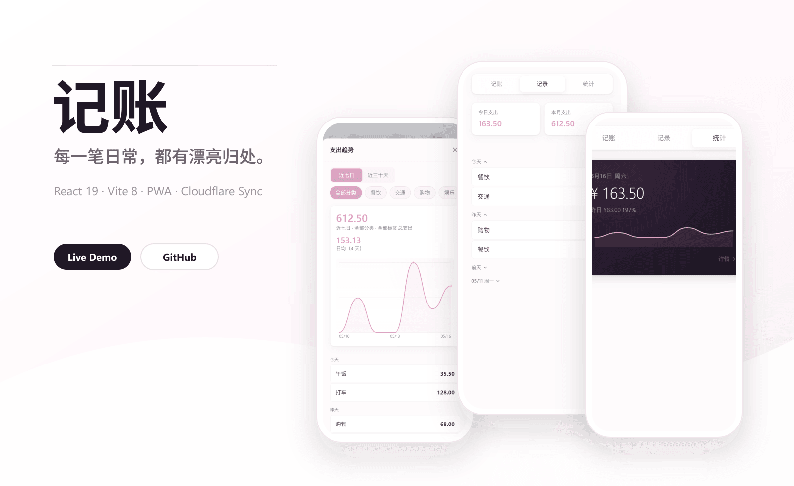
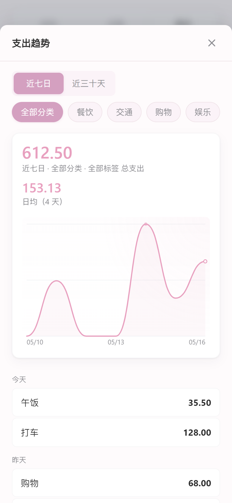

<p align="center">
  <a href="https://accounting-app-9f0.pages.dev">
    
  </a>
</p>

<h1 align="center">记账</h1>

<p align="center">
  <strong>一个安静、漂亮、专注移动端体验的个人记账 PWA。</strong><br />
  少一点输入，多一点确认。把每天的花费，收进一个轻盈的地方。
</p>

<p align="center">
  <a href="https://accounting-app-9f0.pages.dev"><strong>在线体验</strong></a>
  ·
  <a href="#screenshots">界面截图</a>
  ·
  <a href="cloudflare/worker/README.md">云端同步</a>
  ·
  <a href="#development">本地运行</a>
</p>

<p align="center">
  
  
  
  
</p>

<p align="center">
  <a href="https://accounting-app-9f0.pages.dev">
    
  </a>
</p>

## Product

记账不是一个表格，也不是一套财务系统。它更像一件随身小物：打开、记下、合上。界面尽量克制，信息尽量清楚，常用操作放在拇指能自然触到的位置。

它适合一个人长期使用：本地优先、离线可用、支持备份导出，也可以接上 Cloudflare Worker + D1 做私有云同步。

## Highlights

| 体验 | 设计取舍 |
|---|---|
| 快速记一笔 | 金额、分类、标签和备注拆成轻量步骤，不把完整表单一次性压给用户。 |
| 清楚看记录 | 自动按今天、昨天、前天和具体日期分组，日期组可以折叠，单条记录可直接编辑。 |
| 优雅看趋势 | 首页是深色统计卡片，详情页提供近七日/近三十天曲线、分类筛选和最近记录。 |
| 私有数据流 | localStorage 本地保存，JSON/CSV 可导出，Cloudflare D1 同步可选。 |

## Screenshots

<table>
  <tr>
    <td align="center">
      <br />
      <sub>记录一笔</sub>
    </td>
    <td align="center">
      <br />
      <sub>查看记录</sub>
    </td>
    <td align="center">
      <br />
      <sub>统计概览</sub>
    </td>
    <td align="center">
      <br />
      <sub>趋势详情</sub>
    </td>
  </tr>
</table>

## Craft

| Layer | Choice |
|---|---|
| App | React 19 + Vite 8 |
| UI | 手写 CSS、CSS Variables、移动端优先布局 |
| Charts | 纯 SVG 曲线，无图表库依赖 |
| Storage | localStorage 本地持久化 |
| Backup | JSON 备份导入导出，CSV/JSON 记录导出 |
| Sync | 可选 Cloudflare Worker + D1，密码认证，revision 冲突检测 |
| Deploy | Cloudflare Pages |

## Architecture

```text
src/
  components/
    RecordForm.jsx      # 记账表单
    RecordList.jsx      # 记录列表、编辑、备份与同步入口
    Statistics.jsx      # 统计卡片、趋势详情、SVG 曲线
    ManageItems.jsx     # 分类与标签管理
    Header.jsx          # 顶部导航
    Modal.jsx           # 底部弹窗
    TagInput.jsx        # 标签选择
  hooks/
    useRecords.js
    useCategories.js
    useTags.js
  utils/
    backup.js           # 备份导入导出
    export.js           # CSV / JSON 导出
    format.js           # 日期与金额格式化
    statistics.js       # 统计视图模型
    storage.js          # localStorage 封装
    sync.js             # 云端同步客户端
```

## Links

| Link | Description |
|---|---|
| [Live demo](https://accounting-app-9f0.pages.dev) | Cloudflare Pages 线上版本 |
| [Cloud Sync Worker](cloudflare/worker/README.md) | D1 数据库、同步接口和部署说明 |
| [Screenshot script](screenshots/take-screenshots.mjs) | 用 Puppeteer 生成 README 展示图 |
| [Worker source](cloudflare/worker/src/index.js) | 私有同步 Worker 入口 |

## Development

```bash
npm install
npm run dev
```

Build the production version:

```bash
npm run build
```

Refresh README screenshots after UI changes:

```bash
npm run dev -- --host 127.0.0.1 --port 5176
node screenshots/take-screenshots.mjs
```

The screenshot workflow uses the local app at `http://localhost:5176` and writes images into `screenshots/`.

## Cloud Sync

Cloud sync is intentionally optional. The app works fully offline by default. To enable private sync, deploy the Worker in `cloudflare/worker`, create a D1 database, set `SYNC_PASSWORD`, then fill the sync endpoint and password inside the app data manager.

Read the full setup guide here: [cloudflare/worker/README.md](cloudflare/worker/README.md).

## License

MIT
